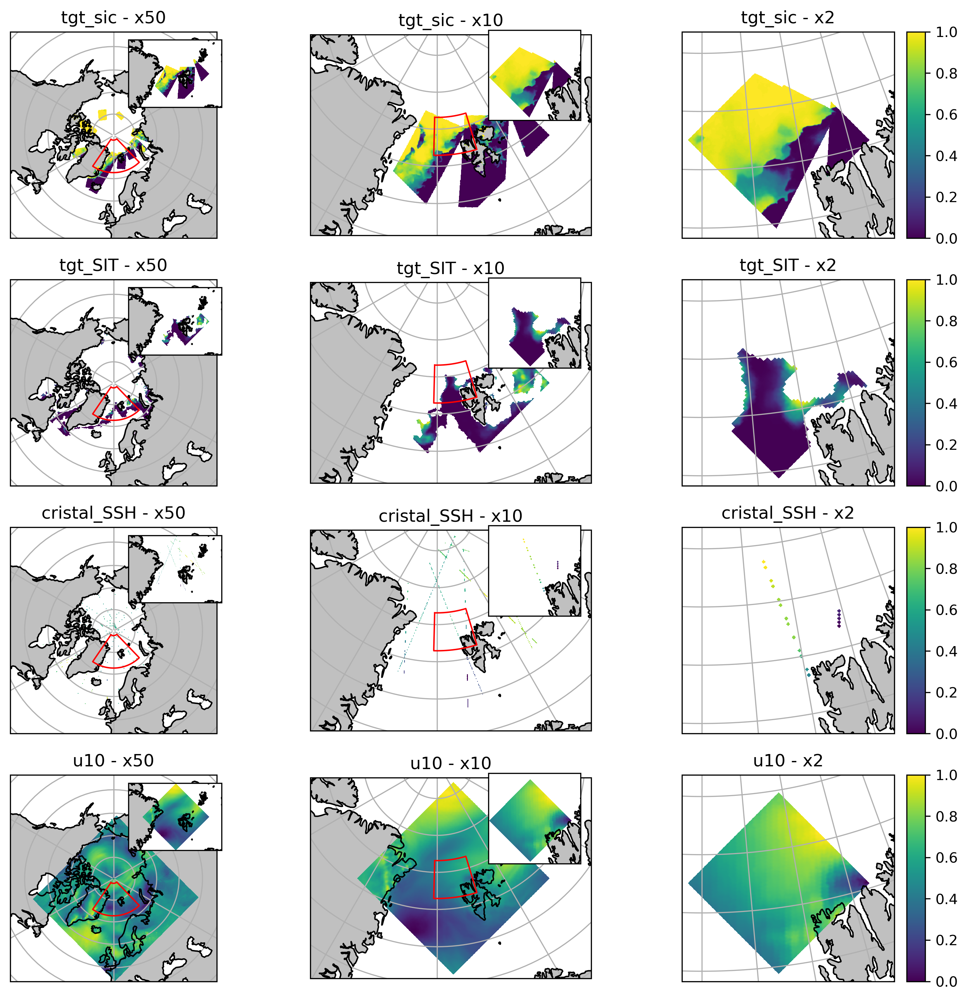

# 4DVarNet Multi-Resolution (CROSCIM)

This repo is a generic **4DVarNet-starter** framework (`src/`, Hydra configs)
on top of which the **CROSCIM** experiment (`contrib/CROSCIM/`) is built:
multi-resolution reconstruction/forecast of Arctic sea-ice variables
(concentration SIC, thickness SIT, snow depth HS, SSH) from satellite
observations (ASIP, CIMR, CRISTAL) and numerical model fields, at three
nested resolutions **x50 (25 km) / x10 (5 km) / x2 (1 km)**.

An older, no-longer-maintained experiment (`ASIP_OSISAF`, single-resolution)
has been archived under [`legacy_ASIP_OSISAF/`](legacy_ASIP_OSISAF/) — see
that section below. Everything else in this README describes the active
CROSCIM pipeline.

## Prerequisites
- git  
- conda  

## Install
### Install project dependencies
```bash
git clone https://github.com/CIA-Oceanix/4dvarnet-starter.git
cd 4dvarnet-starter
conda install -c conda-forge mamba
conda create -n 4dvarnet-starter
conda activate 4dvarnet-starter
mamba env update -f environment.yaml
```

---

## Repository structure

A guided tour of the repo, for anyone new to the code. Skip straight to the
subsection you need.

```
4dvarnet-starter/
├── main.py                  # Hydra entrypoint: `python main.py xp=...`
├── config/                  # Hydra configuration (see below)
├── src/                     # Generic 4DVarNet framework, shared across experiments
├── contrib/CROSCIM/         # CROSCIM-specific code: dataloaders, models, solvers, scripts
├── Notebooks/CROSCIM/       # Exploration / benchmark notebooks
├── legacy_ASIP_OSISAF/      # Archived old experiment (config + contrib + notebooks)
├── ckpt/CROSCIM/            # Saved checkpoints (gitignored, see ASSETS.md)
└── ASSETS.md                # Inventory of large/gitignored files (masks, checkpoints, data)
```

### `config/` — Hydra configuration

- **`config/main.yaml`** — root config. Always invoked as
  `python main.py xp=<path under config/xp, without the .yaml>`.
- **`config/__init__.py`** — registers the `domain` config group
  programmatically (Hydra `ConfigStore`), e.g. `arctic_croscim` (the Arctic
  bounding box used by CROSCIM). This is why you won't find a
  `config/domain/*.yaml` file — domains are Python dicts in this file.
- **`config/base_arctic_croscim.yaml`** — the *original*, self-supervised
  CROSCIM formulation (gap-filling `tgt_sic`/`tgt_SIT`, single
  `Lit4dVarNet_CROSCIM` model). Mostly of historical interest: current work
  happens in `config/xp/CROSCIM/`.
- **`config/params/`** — leftover domain/param presets (`canaries`, `cnatl`,
  `swot`, …) inherited from the generic 4dvarnet-starter template. **Not
  used by CROSCIM** — ignore unless you're working on another ocean
  experiment built on this same framework.
- **`config/xp/CROSCIM/<solver_family>/*.yaml`** — the actual experiment
  configs you run. Grouped by solver architecture:

  | Folder | Model architecture | Key `_target_`s |
  |---|---|---|
  | `4DVarNet_solvers/` | Classical variational 4DVarNet: iterative `GradSolver` (obs cost + prior cost) with a `UNet_OAI` prior network | `solvers.solver.GradSolver(s)` |
  | `UNet_solvers/` | Plain supervised UNet regression (no variational unrolling) — the simplest baseline | `solvers.UNet.UNetSolver` or `solvers.UNet_OAI.UNetModel3` (suffix `UOAI`) |
  | `UNet_unrolling_solvers/` | Expanded/alternate unrolling scheme | `solvers.solver_expanded.GradSolver(s)` |
  | `CM_solvers/` | Consistency Models (diffusion-style generative solver) | `solvers.consistency_solver.*` |
  | `FM_solvers/` | Flow Matching (generative solver) | `solvers.flowmatching_solver.*` |
  | `GNN_solvers/` | Graph neural net connecting patches across resolutions | `solvers.gnn_solver.*` |

  Within each folder, filenames combine these tokens (mix and match):

  | Token | Meaning |
  |---|---|
  | `wpreproc` | Reads **pre-aggregated** NetCDFs (`preproc_CROSCIM_x{2,10,50}.nc`, see *Data preparation*) via `BaseDataModuleMultiResSupervised_simplify` — fast, the recommended path once data is prepared. |
  | `test` (without `simple`) | Reads **raw daily** source NetCDFs directly via `BaseDataModuleMultiRes`, resampling/interpolating patches on the fly — slower, used to validate the pipeline before preprocessing. |
  | `test_simple` | Quick run on the pre-aggregated data (same datamodule as `wpreproc`), for fast iteration/debugging. |
  | `supervised` | Uses ground-truth numerical-model fields (`models_SIT`/`models_SIC`) as targets (`Lit4dVarNet_CROSCIM_Supervised`), used to benchmark against baselines. Omit for the original self-supervised gap-filling formulation. |
  | `res50` / `res10` | Single-resolution run (`multires: [50]` or `[10]`) instead of the full multi-resolution stack. |
  | `UOAI` | Uses the `UNet_OAI` backbone (attention/res-blocks) instead of the plain `UNet`. |
  | `forecast` | Evaluates forecast lead times (`frcst_lead > 0`) beyond the analysis window. |
  | `wbounds` | Adds physical bound constraints on predictions (`add_bounds: True`). |
  | `multiGPU` | Multi-GPU `devices` list. |
  | `_Gefion` | Paths and SLURM settings for the Gefion HPC cluster instead of local/Odyssey paths. |

### `contrib/CROSCIM/` — experiment code

- **`dataloaders/`** — PyTorch/Lightning datamodules and datasets.
  - `data.py` — base classes (`XrDataset`, `XrDatasetSupervised`,
    `BaseDataModule`) shared by everything below; this is where the
    regridding/interpolation logic lives (`interpolate_dataset`, regular-grid
    xarray path vs. `pyresample` swath path, see `itrp_from_regular`).
  - `data_multires.py` / `data_multires_supervised.py` — multi-resolution
    datamodules reading **raw** daily files (`BaseDataModuleMultiRes`, used
    by `test*` configs).
  - `data_simple_multires.py` / `data_simple_multires_supervised.py` —
    multi-resolution datamodules reading the **pre-aggregated** NetCDFs
    (`*_simplify` classes, used by `wpreproc`/`test_simple` configs).
  - `data_simple_multires_gnn.py` — variant feeding the GNN solver.
  - `load_data.py` — path discovery helpers (`get_paths_for_source`) and
    coarsening utilities (`fast_coarsen_xr`).
- **`models/`** — PyTorch Lightning modules (one `LitModule` per training
  scheme): `models.py` (base `Lit4dVarNet_CROSCIM`, self-supervised),
  `models_supervised.py`, `models_consistency.py`, `models_flowmatching.py`,
  `models_gnn.py` (each extends the previous one).
- **`solvers/`** — the actual neural network architectures plugged into the
  Lightning modules via Hydra `_target_`: `solver.py`/`solver_expanded.py`
  (variational `GradSolver`), `UNet.py`/`UNet_OAI.py` (backbones),
  `consistency_solver.py`, `flowmatching_solver.py`, `GNN.py`/`gnn_solver.py`.
- **`scripts/`** — standalone (non-Hydra) utilities, run directly with
  `python`/`bash`, not through `main.py`:
  - `preprocessing_CROSCIM_multires(_supervised).py` — turns raw daily
    source files into per-patch batch NetCDFs (`preproc_batch_*_x{2,10,50}.nc`).
    Launch on a loop with `run_preprocessing_CROSCIM_multires.sh`.
  - `aggregate_xarray.py` + `run_aggregate_all.sh` — aggregate the per-batch
    files into the final `preproc_CROSCIM_x{2,10,50}.nc` (xarray-based,
    parallel per resolution; preferred over the older, ncecat-based
    `agreggate_NetCDFs.sh`, which segfaults at scale).
  - `plot_CROSCIM_multires.py`, `plot_CROSCIM_test_grids.py`, `plot_models.py`,
    `TikZ_forecast.py` — figure generation.
  - `compute_statistics.py` — normalization stats (feeds `norm_stats*` in
    the yaml configs).
  - `create_mod_files.py`, `extract_files_inference.py`,
    `run_benchmark_sequences.py` — data/inference helpers for benchmarking.
- **Static assets**: `mask_PanArctic.nc` (pan-Arctic land/ocean mask,
  gitignored — see `ASSETS.md`), `patch_in_ocean/` (precomputed lists of
  patch indices that fall in ocean, per resolution/split), `natural_earth/`
  + `ne_10m_land.zip` (offline Cartopy coastline shapefiles, so map plotting
  doesn't need internet access).

### `Notebooks/CROSCIM/` — exploration & benchmarks

- **`Notebook_CROSCIM_dataloader.ipynb`** — start here to understand the
  data: raw file inspection, spatial overview of all sources/variables,
  instantiates the real `BaseDataModuleMultiRes` datamodule, inspects a
  multi-resolution batch, and visualizes the patch geometry (including the
  hierarchical inter-patch graph used by `GNN_solvers`).
- **`Notebook_Benchmark_CROSCIM_SIC.ipynb`** / **`..._SIT.ipynb`** — compare
  trained methods (UNet-UOAI, UNet-Unrolling, …) against reference/persistence
  on held-out sequences: geographic maps, RMSE maps, spectral analysis.
- **`Notebook_CROSCIM_test_simplify.ipynb`** — sanity-checks the
  `*_simplify` (pre-aggregated) datamodule pipeline.
- **`strategy_add_bounds.ipynb`** — exploration around the `wbounds`
  (physical bound constraints) option.

### `src/` — generic framework (not CROSCIM-specific)

Shared 4DVarNet-starter infrastructure used by CROSCIM and by other
experiments built on this template: `train.py` (`base_training` entrypoint
called from `main.py`), `utils.py` (metrics, time weighting), `models.py`
(base `Lit4dVarNet`), `resolvers.py` (custom OmegaConf resolvers like
`python_eval`), `ose/` (operational-scale-evaluation helpers, unrelated to
CROSCIM).

### `legacy_ASIP_OSISAF/` — archived experiment

The predecessor to CROSCIM: a single-resolution Arctic sea-ice pipeline
based on ASIP/OSISAF data. Kept for reference, **not maintained**, mirrors
the same three-part layout as the active code:

```
legacy_ASIP_OSISAF/
├── config/xp/ASIP_OSISAF/   # experiment configs
├── contrib/ASIP_OSISAF/     # dataloaders, models, solver
└── Notebooks/ASIP_OSISAF/   # notebooks (diffusion, VAE, consistency models)
```

None of the active `config/xp/CROSCIM` or `contrib/CROSCIM` code depends on
this folder.

---

## Data preparation

The multiresolution training relies on **preprocessed NetCDF files** provided at different spatial resolutions (e.g. x2, x10, x50).

1. Generate per-patch batch files from the raw daily sources:
   ```bash
   bash contrib/CROSCIM/scripts/run_preprocessing_CROSCIM_multires.sh
   ```
   (loops `preprocessing_CROSCIM_multires_supervised.py`, restarting it on crash).
2. Aggregate the batches into one NetCDF per resolution:
   ```bash
   bash contrib/CROSCIM/scripts/run_aggregate_all.sh
   ```

After preprocessing, you should obtain files like:
```
/Odyssey/public/CROSCIM_dataset/preproc_CROSCIM_x2.nc
/Odyssey/public/CROSCIM_dataset/preproc_CROSCIM_x10.nc
/Odyssey/public/CROSCIM_dataset/preproc_CROSCIM_x50.nc
```

These files are used directly by the datamodule (with preprocessing of the batches).

---

## Run

The model uses **Hydra** for configuration.  
You can run a multiresolution experiment with:

```bash
python main.py xp=CROSCIM/base_arctic_croscim_wpreproc.yaml
```

This will load the `BaseDataModuleMultiRes_simplify` datamodule and the `Lit4dVarNet_CROSCIM` model with multiple solvers (x2, x10, x50).

To pick a different solver architecture (UNet, 4DVarNet, Consistency Model,
Flow Matching, GNN, …), point `xp=` at the matching file under
`config/xp/CROSCIM/<solver_family>/`, e.g.:

```bash
python main.py xp=CROSCIM/UNet_solvers/base_arctic_croscim_wpreproc_sit_supervised.yaml
python main.py xp=CROSCIM/CM_solvers/base_arctic_croscim_wpreproc_sit_supervised_wbounds.yaml
```

See the naming-convention table in *Repository structure* above to decode a
given filename.

---

## Visualization

To visualize how the different resolutions nest into one another, you can run the plotting script:

```bash
python contrib/CROSCIM/plot_CROSCIM_multires.py
```

This produces the figure:


showing the variables of interest (`tgt_sic`, `cimr_SIT`, `cristal_SSH`, `u10`) arranged by **resolution** (columns) and **variable** (rows), with inset zooms between nested grids.

---

## Saved weights

Checkpoints live under `ckpt/CROSCIM/` and are gitignored (large binaries) —
see the inventory in [`ASSETS.md`](ASSETS.md) for what's currently on disk.

---

## Useful links
- [Hydra documentation](https://hydra.cc/docs/intro/)  
- [PyTorch Lightning documentation](https://pytorch-lightning.readthedocs.io/en/stable/index.html#get-started)  
- 4DVarNet papers:
  - Fablet, R.; Amar, M. M.; Febvre, Q.; Beauchamp, M.; Chapron, B. *END-TO-END PHYSICS-INFORMED REPRESENTATION LEARNING FOR SATELLITE OCEAN REMOTE SENSING DATA: APPLICATIONS TO SATELLITE ALTIMETRY AND SEA SURFACE CURRENTS.* ISPRS Annals 2021. https://doi.org/10.5194/isprs-annals-v-3-2021-295-2021  
  - Fablet, R.; Chapron, B.; Drumetz, L.; Mmin, E.; Pannekoucke, O.; Rousseau, F. *Learning Variational Data Assimilation Models and Solvers.* JAMES 2021. https://doi.org/10.1029/2021MS002572  
  - Fablet, R.; Beauchamp, M.; Drumetz, L.; Rousseau, F. *Joint Interpolation and Representation Learning for Irregularly Sampled Satellite-Derived Geophysical Fields.* Frontiers in Applied Mathematics and Statistics 2021. https://doi.org/10.3389/fams.2021.655224
