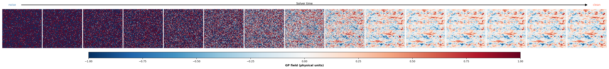
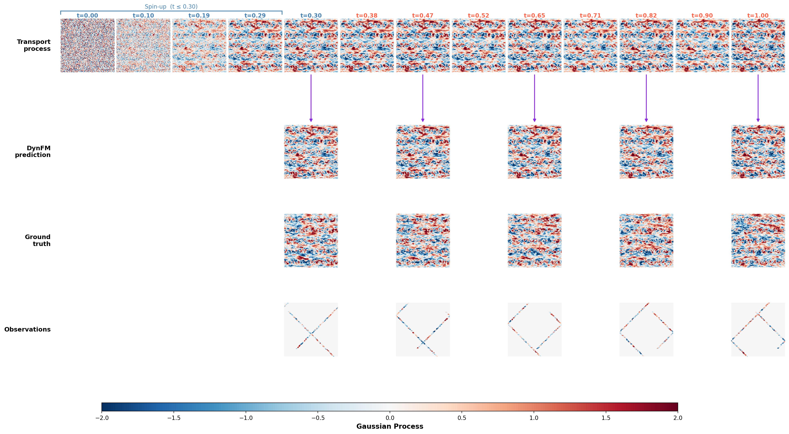
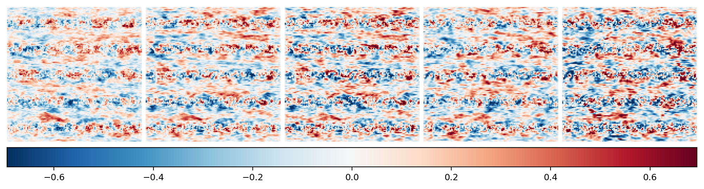

# Consistency Models & Flow Matching for Generative Data Assimilation

This branch is a split-off of the `devs` development branch of
[4dvarnet-starter](https://github.com/maxbeauchamp/4dvarnet-starter): it keeps
only the `consistency/` research code (pairwise Consistency Models and Flow
Matching for ensemble/generative reconstruction of geophysical fields) and
its minimal dependencies, dropping the unrelated `devs` work (other
notebooks, configs, contrib modules, …).

## What's here

Eight reconstruction methods are compared across three variables (`GP`,
`SIC`, `SSH_GF`), each implemented as a standalone Jupyter notebook under
`consistency/Notebooks/Notebooks_<XP>/`:

| Method | Type | Idea |
|---|---|---|
| `UNet` | deterministic | direct regression baseline |
| `4dvarnet_lstm` | deterministic | 4DVarNet variational solver with an LSTM gradient step |
| `CM` | generative | pairwise Consistency Model (Karras noise schedule) |
| `VarCM` | generative | CM + variational conditioning (observation / cost-gradient) |
| `DynCM` | generative | CM extended to sequences: spin-up (noise→initial condition) + physical (sequential frames) regimes |
| `VarDynCM` | generative | DynCM + variational conditioning (physical regime only) |
| `FM` | generative | Flow Matching, linear-interpolant velocity regression |
| `DynFM` | generative | FM extended to sequences, same spin-up/physical split as DynCM |

The six generative methods produce an ensemble (mean, spread, CRPS); the two
deterministic ones don't.

## Datasets (`xp`)

- **`GP`** — synthetic Gaussian Process / SPDE field, used as the reference
  test-bed (all 8 methods first validated here).
- **`SIC`** — Arctic sea-ice concentration, self-supervised on gappy ASIP
  targets with OSISAF conditioning (`src/dataloader_SIC.py`).
- **`SSH_GF`** — Gulf Stream sea surface height from along-track altimetry.

## A few results (GP)

CM: single-frame transport from noise to the clean field along the Karras
schedule.



DynFM: the same idea extended to a sequence — a spin-up segment (noise → IC)
followed by a physical segment (frame-to-frame transport), each compared
against ground truth and the sparse observations actually seen by the model.



DynCM: reconstructed 5-frame ensemble mean.



More figures (ensemble members, spread, per-method) are under
`consistency/Notebooks/Notebooks_<XP>/figures/`, regenerated by each
notebook.

## Repository layout

```
consistency/
├── consistency_models/          # CM / VarCM / DynCM / VarDynCM pairwise-consistency preconditioning + utils
├── flowmatching_models/
│   └── flowmatching_models_FM.py # FM network + Lightning module, shared by the FM and DynFM
│                                  # notebooks (DynFM's own LitDynFM is defined inline)
├── spectral_utils.py            # shared PSD / resolved-scale (λx) metric
├── cartopy/                     # local cartopy shapefile cache (map backgrounds for SIC/SSH_GF plots)
├── Notebooks/
│   ├── Notebooks_GP/             # GP / SPDE xp: one notebook per method + figures/
│   ├── Notebooks_SIC/             # SIC xp
│   └── Notebooks_SSH_GF/           # SSH_GF xp
├── sbatch_submission/            # papermill training + metrics + LaTeX-table pipeline — see its own README
└── figs/                          # misc standalone illustrations

src/
├── dataloader_SSH.py             # SSH_GF datamodule (BaseDataModule)
├── dataloader_SPDE.py            # GP/SPDE datamodule (SPDEDataModule)
└── dataloader_SIC.py             # SIC datamodule (BaseDataModule, ASIP/OSISAF), trimmed from
                                   # the former contrib/ASIP_OSISAF/data_simple.py to just the
                                   # dataloader classes actually imported by the notebooks
```

Everything above is the complete dependency closure of the notebooks
(verified by grepping every `from src...` import across `consistency/`) —
nothing in this branch is unused scaffolding. There is no `contrib/` on this
branch: the SIC dataloader used to live at `contrib/ASIP_OSISAF/data_simple.py`
and pull in a whole (mostly unused) `contrib/ASIP_OSISAF/` package; only the
two classes actually imported by the notebooks (`BaseDataModule`,
`TrainingItem_4da`) were kept, moved to `src/dataloader_SIC.py` alongside the
other two dataloaders.

## Install

```bash
mamba env create -n consistency_models -f environment.yaml
conda activate consistency_models
```

## Running

Either open a notebook directly under `consistency/Notebooks/Notebooks_<XP>/`
in Jupyter, or drive the full training + metrics pipeline via `papermill`
from the cluster:

```bash
cd consistency/sbatch_submission
sbatch submit_train.sbatch GP     # trains all 8 methods sequentially
sbatch submit_metrics.sbatch GP   # reloads each checkpoint, computes ensemble metrics, writes the LaTeX table
cat results/GP/comparison_table.tex
```

See `consistency/sbatch_submission/README.md` for the pipeline's design
notes, the method registry (`methods.yaml`), and known limitations of the
notebooks generated for SIC/SSH_GF.

## References

- Song, Y., Dhariwal, P., Chen, M., & Sutskever, I. (2023). Consistency Models. *ICML 2023*.
- Lipman, Y., Chen, R. T. Q., Ben-Hamu, H., Nickel, M., & Le, M. (2023). Flow Matching for Generative Modeling. *ICLR 2023*.
- Beauchamp, M., Desassis, N., Johnson, J. E., Benaichouche, S., Tandeo, P., & Fablet, R. (2024). SPDE priors for uncertainty quantification of end-to-end neural data assimilation schemes. https://arxiv.org/abs/2402.01855
- Beauchamp M., Febvre Q., and Fablet R. Ensemble-based 4DVarNet uncertainty quantification for the reconstruction of sea surface height dynamics. *Environmental Data Science*, 2:e18, 2023. doi: 10.1017/eds.2023.19.
- Beauchamp, M., Febvre Q., Georgenthum H., and Fablet R. 4DVarNet-SSH: End-to-end learning of variational interpolation schemes for nadir and wide-swath satellite altimetry. *Geoscientific Model Development*, 16(8):2119–2147, 2023. doi: 10.5194/gmd-16-2119-2023.
